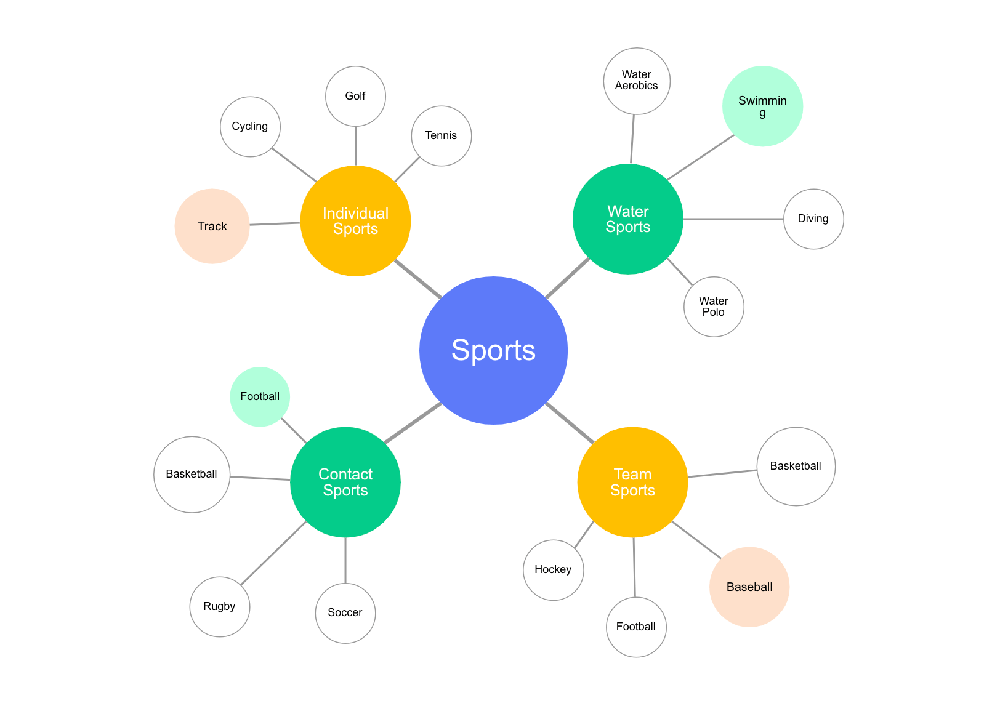
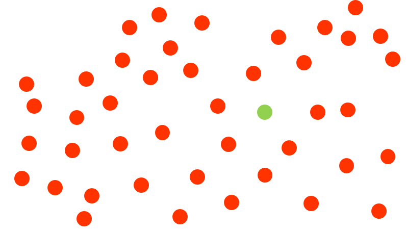
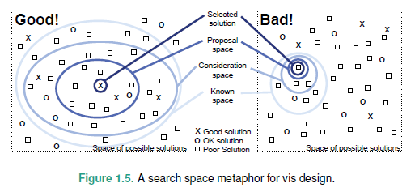
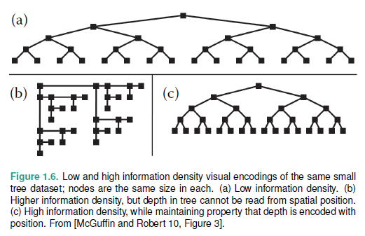
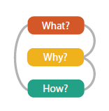
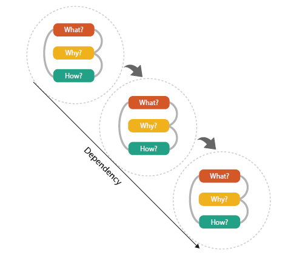

# "What's Vis, and Why Do It?"

## What's Vis, and Why Do It?

### 1.1 The Big Picture

### 1.2 Why have a human in the loop?
- 시각화는 사용자가 정확히 자신이 가진 문제점이 뭔지 모르는 상황에서 데이터 분석시 도움을 준다.
  - 사용자가 가진 문제가 well-defined question 이라면, 통계학이나 머신러닝과 같은 computational technique 으로 해결 가능하다.
  - 완전하게 자동화되는 솔루션이 가능하다면, human judgement, vis tool이 필요하지 않다.
    - Stock market trading 분야

- 그러나, 많은 분석 문제들은 명확하게 구체화되어 있지 않을 뿐더러, 어떻게 문제에 접근하는지 조차 모른다. 심지어 가능한 질문들이 **수십에서 수천**에 달한다. 그러나, 어떤 질문이 올바른 것인지 미리 알 수 없다.
- 이 때, 가장 좋은 방법은 사용자를 분석 과정 안에 넣는 것이다.
- _Vis systems are appropriate for use when your goal is to **augment human capabilities**, rather than completely replace the human in the loop._  
 

### Use Cases
1. Transitional use
    - _"work itself out of a job"_ - 순수하게 computational solution 도출을 돕는 것.
    - Early stage
      - e.g., 수학적 모델 고안하기 전, 태스크나 분석의 requirements를 파악하기 위한 발판으로 vis tool을 사용한다. 
    - Middle stage
      - e.g., Computational solution을 refine, debug, extend 하거나 알고리즘의 parameters 에 따른 효과를 이해하기 위해 사용한다.
      - 여기서는 최종 시스템의 end user가 아닌 다른 사용자(Algorithm developers)를 targeting한다. 만약 end user를 위한 vis tool이 필요하다면, **새로운 디자인**이 필요하다.
      - Stock market trading 예시로 보면, vis tool 을 통해 다양한 trading algorithms을 정교화하는 데에는 도움을 줄 수 있지만, 최종적인 stock market trading 시스템의 end user에게는 도움을 줄 수 없다.
    - Late stage
      - e.g., 시스템 결과가 신뢰할만한 결과를 도출하는지 확인하기 위한 용도
    - Decision 이 완료되면 버려진다.

2. Long-term use
    - 사용자가 loop에 머무르면서, 시스템을 계속해서 monitoring 한다.
    - 현재로서 연구 과정이 완전하게 자동화되기 힘든 분야에서 사용한다.
      - e.g., scientific discovery - 사용자가 가설을 세우고 확인하는 능력을 향상시켜주기 위한 목적 
3. For presentation
    - 이미 알고 있는 지식이나 사실을 다른 사람들에게 설명하기 위한 수단으로 사용한다.  
      - Storytelling
 

### 1.3 Why have a computer in the loop?
- 사람의 attention span은 굉장히 한정되어 있기 때문에 수백개의 데이터를 처리하는 데에도 수시간에서 수일 소요된다.   
  그러나 real-world datasets는 방대하고 계속하여 변화한다. 따라서 computer-based tool을 사용함으로써 human effort를 줄여줄 수 있다.  
  - Scalability, generalization 가능하다.
 

### 1.4 Why use an external representation?
- 인간의 가진 인지 능력과 메모리는 제한되어 있다. Vis는 external representation을 사용하여 사용자의 internal cognition과 memory의 필요성을 줄여준다.
- 다양한 형태의 external representation이 있지만, 이 책에서는 2D display surface로만 언급될 예정이다.
- Diagram
  - 사람의 자연스러운 인지 추론 과정을 도와주기 위해 디자인됨.
  - 아이템이나 정보를 그룹화함으로써 search, recognition을 도와준다. (cf. recall)  
 

  
 

### 1.5 Why depend on vision?
- 시각화는 human visual system을 의사소통의 수단으로 사용한다.
- Visual system 은 bandwidth가 넓다(100MB/s, 귀는 < 100B/s).  
 Preattentive processing : Preconscious level과 동등하게 시각적인 정보 처리가 발생한다.
  - Visual popout 
    - vision의 전체 범위에 걸쳐 병렬적으로 발생하기 때문에 다른 물체의 범위 크기에 관계 없이 발생한다. 
  

  
 

- 소리는 vision에 비해 많은 양의 정보의 overview를 제공하는데 적합하지 않다. 또한, 소리는 sequential stream으로 인지기 때문에 오랜 시간에 걸쳐 발생한 소리는 자동으로 합쳐진다.
- taste, smell, haptic 등의 감각들은 아직 기술적인 한계로 어렵다.  
 

### 1.6 Why show the data in detail?
- dataset의 간단한 summary를 제공하기보다 구조에 대한 자세한 정보를 제공하는 것이 좋다.
- dataset의 통계적인 특징은 가장 흔한 접근 방법 중 하나이다. 그러나 summarization을 함으로써 정보의 손실이 발생한다는 한계가 있다 (Over-simplify).
- Anscombe's Quartet
  - 4가지 데이터셋은 모두 동일한 mean, variance, correlation, linear regression line 을 갖는다.
  - 1 : normal 2 : nonlinear pattern 3 : one outlier 4 : completely misleading

  
 

### 1.7 Why use interactivity?
- Interactivity 는 vis tool 의 complexity와 volumn을 다루기 위해 필수적이다. dataset이 커질수록 사용자와 display 의 한계로 인해 모든 데이터를 한번에 보여줄 수 없다. 
- 다이나믹 쿼리를 지원하기 위해서는 **interaction 은 필수적**이다. 
- 고차원적인 overview 에서부터 작은 부분의 detailed view 까지 다양한 레벨의 detail 을 지원한다.  
 

### 1.8 Why is the vis idiom design space huge?
- vis Idiom
  - a distinct approach to creating and manipulating visual representations.
- Interaction 까지 추가되면서 design space 는 더 방대해졌다.
  - Interaction 을 사용하여 여러 개의 간단한 차트들을 linking 가능.  
 

### 1.9 Why focus on tasks?
- 동일한 dataset에서 하나의 task에 적합하도록 디자인된 툴은 다른 테스크에는 적절하지 않을 수 있다. 
- Why를 설명하기 위하여 domain-specific한 형태의 사용자의 테스크를 abtract한 형태로 변경하는 작업이 필요하다 (generic words의 필요성).  
 

### 1.10 Why focus on effectiveness?
- user tasks를 얼마나 잘 지원하는지에 대한 평가
  - correctness, accuracy, truth
- _"it's not just about making pretty pictures"_
  - vis designer는 artists가 아니다. 결과에 대한 목표는 예쁜 것이 아니라, 효과적이어야 한다.
- correctness 
  - 데이터에 대한 모든 표현은 abstraction 형태이다. 모든 결정이 어떠한 면을 강조할지에 따라 이루어지기 때문에 correctness를 평가하기 어렵다.  
- 아이러니하게도 targeted design 일수록, popular design 이 될 확률이 높다.  
 

### 1.11 Why are most designs ineffective?
- visual design space는 매우 방대하다. 그러나 대부분은 ineffective하다. 그 이유로는 인간의 인지적, 지각적 시스템에 적합하지 않아서, 또는 의도하는 task에 맞지 않아서 등등. 아주 일부만이 좋은 디자인이라 할 수 있다. 
- 아래 그림과 같이 known space, consideration space 를 넓힐수록 effective design 을 찾을 수 있다.
- 즉각적으로 하나의 솔루션을 고정하기보다는 다양한 대안들을 충분히 살펴보는 것이 중요하다.

  
 

### 1.12 Why is validation difficult?
- vis design에 대한 validation은 어렵다. goal을 만족하는지 판단할 때 할 수 있는 질문이 무궁무진하기 때문에...
- 이 디자인이 다른 디자인에 비해 좋거나 안좋은 이유가 뭘까? better이라는 의미는? 사용자가 태스크를 빠르게 수행하나? 사용자들이 이 tool을 통해 더 재밌는 것을 많이 하나? 효과적으로 일을 하게 되었나? effectively하다는 것은 여기서 무슨 의미인가? 등 등....
- 사용자는 누구인가? 이 태스크를 수년이상 수행해본 전문가인가? 아니면 시작하기전에 태스크가 무엇인지 설명을 들어야하는 수준의 novice인가? 이 시스템을 처음 보는 사람인가? 아니면 익숙한 사람인가?

### 1.13 Why are there resource limitations?
- 시각화 시스템을 설계할 때 3가지 limitation에 대한 고려가 필요하다.
    - computational capacity
    - human perceptual and cognitive capacity
    - display capacity

- 시각화 시스템은 필연적으로 방대한 양의 데이터를 다루어야 하므로 **scalability** 가 주요한 이슈이다.
    - 여러 다양한 이유로 dataset 사이즈는 계속해서 증가하는 추세.
    - computer capacity 또한 향상되어 가고 있다.

- Computer side
- Human side
    - memory and attention 자원이 제한되어 있다.
    - 인간은 놀랄만큼 굉장히 적은 정보를 저장할 수 있다. 
    - **change blindness**
      - 사람은 무언가 일을 집중하여 수행하고 있을 때 다른 부분에서 엄청난 변화가 발생해도 이를 눈치채지 못한다.
- Display capacity
    - 모든 정보를 동시에 보여주기에는 해상도가 충분하지 못하다.
    - Information density : 사용하지 않는 공간 대비 encoded된 정보의 양에 대한 measure 방법
    - 모든 정보를 한번에 제공함으로써 navigation과 exploration의 필요성을 줄이는 장점과 비용 간의 trade-off가 있다. 좋은 디자인의 목표는 이 둘 사이의 적절한 balance를 찾는 것이다.

  
 

### 1.14 Why analyze?
- high-level framework for analyzing vis use according to three questions
    - **What** data the user sees,
    - **Why** the user intends to use a vis tool,
    - **How** the visual encoding and interaction idioms are constructed in terms of design choices

  
 

- **what-why-how  = data-task-idiom**
- 이 3단계를 하나의 instance라 한다.
- 단순한 vis tool은 독립된 instance로도 구성할 수 있지만, 복잡한 vis tool은 dependencies가 있는 instances chaining을 필요로 한다. output이 또다른 instance의 input이 되는 형태이다.
- 예를 들어, 사용자가 vis tool에서 보이는 항목들을 소팅한다. 이는 소팅 그 자체가 결과물로 소팅된 list를 갖는 것이 목적일 수도 있지만, 이를 통해 outlier를 발견하기 위한 수단이 될 수도 있다.

  
 
